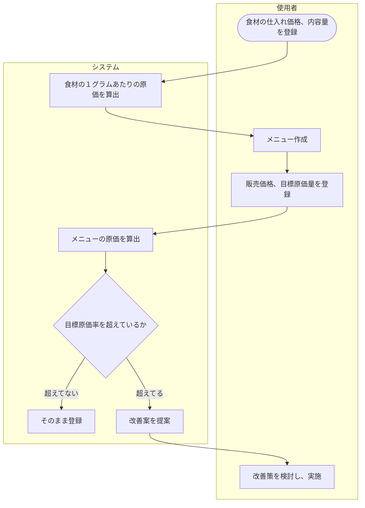

# 設計

## 1.業務フロー

```mermaid
flowchart TD
    subgraph 使用者
        A(["食材の仕入れ価格、内容量を登録"])
        B["メニュー作成"]
        C["販売価格、目標原価量を登録"]
        I["改善策を検討し、実施"]
    end

    subgraph システム
        D["食材の１グラムあたりの原価を算出"]
        E["メニューの原価を算出"]
        F{"目標原価率を超えているか"}
        G["そのまま登録"]
        H["改善案を提案"]
    end

    A --> D --> B --> C --> E --> F
    F -->|超えてる| H
    F -->|超えてない| G
    H --> I
```
