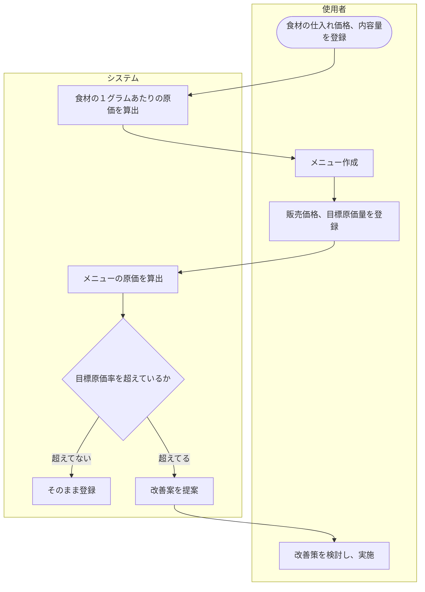
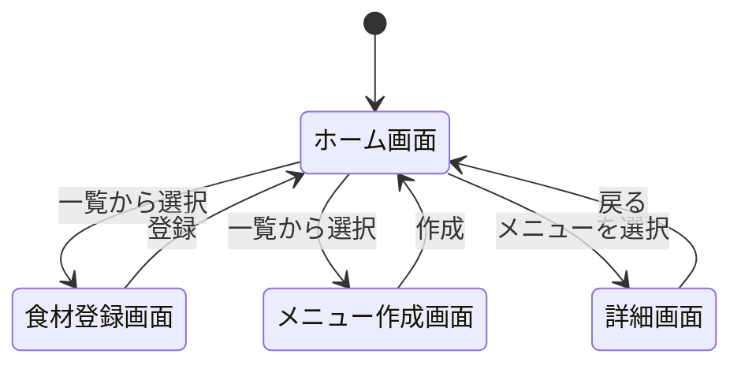

# 設計

## 1.業務フロー

## 2.画面遷移図

## 3.ワイヤーフレーム

## 4.テーブル定義書

### テーブル一覧

| テーブル名 | 概要 |
| --- | --- |
| ingredients | 食材 |
| menu | メニュー |
| menu_ingredients | メニュー構成 |

#### 食材テーブル

| 論理名 | 物理名 | データ型 | 桁数 | NULL | キー | デフォルト |
| --- | --- | --- | --- | --- | --- | --- |
| 食材ID | ingredient_id | BIGINT | - | 不可 | PK | 自動採番 |
| 食材名 | ingredient_name | VARCHAR	| 100 |	不可 |　| - |
| 仕入れ価格 | purchase_price	| DECIMAL | 10,2 | 不可 | | - |
| 内容量	| purchase_amount |	DECIMAL	| 10,2 | 不可 | | - |
| 1gあたり原価 | unit_cost | DECIMAL | 10,4 | 不可 | | 0 |
| 登録日時 | created_at | DATETIME | - | 不可 | | 現在日時 |
| 更新日時 | updated_at | DATETIME | - | 不可 | | 現在日時 |

制約・インデックス

- PRIMARY KEY (ingredient_id)
- UNIQUE (ingredient_name)（同名食材の重複登録を防止する）

#### メニューテーブル

| 論理名 | 物理名 | データ型 | 桁数 | NULL | キー | デフォルト |
| --- | --- | --- | --- | --- | --- | --- |
| メニューID | menu_id | BIGINT | - | 不可 | PK | 自動採番 |
| メニュー名 | menu_name | VARCHAR | 100 | 不可 | | - |
| 販売価格 | selling_price | DECIMAL | 10,2 | 不可 | | - |
| 目標原価率 | target_cost_rate | DECIMAL | 5,2 | 不可 | | - |
| 原価合計 | total_cost | DECIMAL | 10,2 | 不可 | | 0 |
| 現在原価率 | current_cost_rate | DECIMAL | 5,2 | 不可 | | 0 |
| 原価率超過フラグ | is_over_target | TINYINT | 1 | 不可 | | 0 |
| 登録日時 | created_at | DATETIME | - | 不可 | 現在日時 |	
| 更新日時 | updated_at | DATETIME | - | 不可 | 現在日時 |

制約・インデックス

- PRIMARY KEY (menu_id)

備考

- 販売価格と目標原価率を保存し、使用食材から算出した原価合計・現在原価率・超過フラグをあわせて保持する。current_cost_rate が target_cost_rate を超えた時点で is_over_target を1に更新し、ホーム画面のNGバッジ・アラートバナー表示のトリガーとする。

#### メニュー構成テーブル

| 論理名 | 物理名 | データ型 | 桁数 | NULL | キー | デフォルト |
| --- | --- | --- | --- | --- | --- | --- |
| メニュー構成ID | menu_ingredient_id | BIGINT | - | 不可 | PK | 自動採番 |
| メニューID | menu_id | BIGINT | - | 不可 | FK | | - |
| 食材ID | ingredient_id | BIGINT | - | 不可 | FK | | - |	
| 使用量 | usage_amount | DECIMAL | 10,2 | 不可 | | - |
| 小原価 | line_cost | DECIMAL | 10,2 | 不可 | | 0 |
| 登録日時 | created_at | DATETIME | - | 不可 | | 現在日時 |
| 更新日時 | updated_at | DATETIME | - | 不可 | | 現在日時 |

制約・インデックス

- PRIMARY KEY (menu_ingredient_id)
- FOREIGN KEY (menu_id) REFERENCES m_menu(menu_id) ON DELETE CASCADE
- FOREIGN KEY (ingredient_id) REFERENCES m_ingredient(ingredient_id)
- UNIQUE (menu_id, ingredient_id) (同一メニュー内で同一食材の重複行を許可しない)

備考
- どのメニューにどの食材を何g使用するかを1行1組で管理する中間テーブル。メニューの原価合計は、このテーブルの line_cost をメニューIDで合計して算出する。

